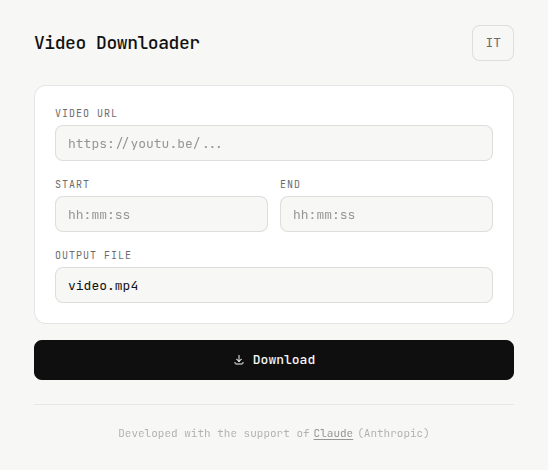

# Video Downloader

Video Downloader lets you download segments from YouTube videos (including long streams) using `yt-dlp`.

Fill in the URL, start/end timestamps, and output filename, the app handles the rest.

---

## Screenshot



---

## Features

- Download a specific time segment from any YouTube video or stream
- Simple form: URL, start time, end time, output filename
- Visual spinner while download is running
- Success / error feedback
- Validates `yt-dlp` availability on startup

---

## Requirements

- [`yt-dlp`](https://github.com/yt-dlp/yt-dlp) must be installed and available in `PATH`

```bash
sudo snap install yt-dlp
```

---

## Install

```bash
curl -fsSL https://github.com/gsandrini/video-downloader/releases/latest/download/install.sh | bash
```

---

### Uninstall

```bash
curl -fsSL https://github.com/gsandrini/video-downloader/releases/latest/download/install.sh | bash -s -- --uninstall
```

---

## Tech stack

- [Wails](https://wails.io) - Desktop framework (Go + WebView)
- [Go](https://golang.org) - Backend logic
- [Alpine.js](https://alpinejs.dev) - Reactive UI (bundled locally)
- [Tailwind CSS](https://tailwindcss.com) - Styling (compiled locally)
- [JetBrains Mono](https://www.jetbrains.com/lp/mono/) - Typography

---

## Built with

This project was built with the support of [Claude](https://claude.ai) by Anthropic.

---

## Contributing

This repository is published for personal use / GitHub Pages only.
Pull requests and issues will not be reviewed or accepted.

---

## License

This project is licensed under the **GNU General Public License v3.0**.
See the [LICENSE](LICENSE) file for details.
